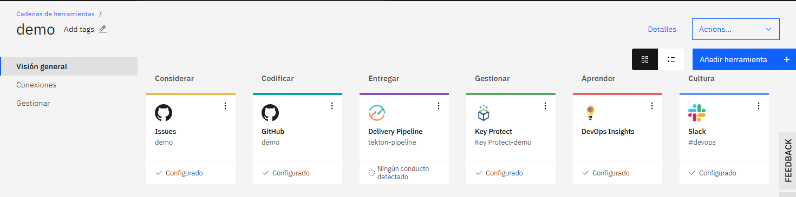

# Desplegando Aplicaciones con IBM DevOps

#### **Introducción**
Este tutorial muestra como configurar un pipeline elaborado con tekton haciendo uso de IBM Delivery pipeline y IBM Toolchain. con la finalidad de desplegar una aplicación en nodejs con infraestructura como codigo (terraform).

Asimismo comprendera los conceptos necesarios para crear sus propios pipelines con tekton.

tekton nos permitira crear recursos dentro del cluster publico gestionado por IBM para poder ejecutar los pasos indicados en el pipeline.


#### **Requisitos Previos**

Contar con una cuenta en:
- [IBMCloud](https://cloud.ibm.com/)
- [GitHub](http://github.com/) y tener una SSH keys asociada a su cuenta.
- [Slack](https://slack.com/) y tener un canal creado.

> [!TIP]
> Al iniciar este tutorial debe estar logueado en las 3 cuentas mencionadas con anterioridad para facilitar la implementación.

> [!IMPORTANT]
> Todos los componentes deben ser creados en la misma region y el mismo resource group para evitar posibles conflictos.
> 
#### **Tiempo Estimado**
El tiempo estimado para completar el tutorial es de 60 a 90 minutos.

#### **Pasos**

1. Obtener información de herramientas a integrar.
    - Para poder integrar tekton con ibm toolchain sus plantillas yml deben estar versionadas en un repositorio por lo cual puede crear uno de la siguiente manera:
        - Ingrese [aqui](https://github.com/new)
        - Seleccionar un propietario.
        - Ingresar un nombre para el repositorio.
        - Seleccionar si desea que sea publico o privado.
        - dar click en *Create repository*
        - 

    - Para poder integrar slack a ibm toolchain vamos a requerir crear una aplicación dentro de slack de la siguiente forma:
        - Ingrese [aqui](https://api.slack.com/apps)
        - De click en el boton Create New App
        - Ingrese un nombre para su app
        - De click en el boton Create App
        - 

    - Una vez creada la aplicacion del paso anterior procederemos a crear un webhook de la siguiente forma:
        - Ingresamos a la seccion de *información basica* de la aplicación creada anteriormente.
        - Seleccionamos Incoming WebHooks.
        - Una vez dentro cambiamos la opción a *On*.
        - en la parte inferior damos click en el boton Add New Webhook to Workspace.
        - Seleccionamos el canal de nuestra preferencia.
        - Copiamos el Webhook URL en un lugar seguro.
        - 

1. Creación de Key Protect

    - Ingrese [aqui](https://cloud.ibm.com/catalog/services/key-protect)
    - Ingrese un nombre para el repositorio de claves
    - Seleccionar un grupo de recursos.
    - Dar click en crear.
    - 

1. Creación de IBM Schematics
    - Ingrese [aqui](https://cloud.ibm.com/schematics/workspaces/create)
    - Ingrese nombre para espacio de trabajo.
    - Seleccione el grupo de recursos.
    - Seleccione la ubicación (Region).
    - De click en crear
    - 

1. Creación de IBM ToolChain.

    - Ingrese [aqui](https://cloud.ibm.com/devops/create)
    - Seleccione la opción *Cree su propia cadena de herramientas*
    - Ingrese un nombre
    - Seleccione una region
    - Seleccione un grupo de recursos
    - De click en crear
    - 

1. Añadiendo herramientas a IBM ToolChain
    - Github
        - Dar click en *añadir herramienta*
        - Buscar *github* y seleccionar.
        - Dar click en el boton autorizar IBM-Cloud.
        - En el Tipo de Repositorio seleccionar *Existente*.
        - Seleccionar la URL de nuestro repositorio (creado en el paso 1).
        - Marcar ambos checks para habilitar el seguimiento.
        - Dar click en el boton *Crear Integración*.
    - IBM Delivery Pipeline
        - Dar click en *añadir herramienta*
        - Buscar Delivery Pipeline y seleccionar.
        - Ingrese un nombre.
        - Seleccione Tekton como Tipo de conducto.
        - Dar click en el boton Crear Integración.
    - KeyProtect
        - Dar click en *añadir herramienta*
        - Buscar KeyProtect y seleccionar.
        - Seleccione la región donde creo su keyprotect.
        - Seleccione el grupo de recursos donde se encuentra su keyprotect.
        - Ingrese el nombre asignado a su keyprotect.
        - Dar click en el boton Crear Integración.
    - DevOps Insights
        - Dar click en *añadir herramienta*
        - Buscar DevOps Insights y seleccionar.
        - Dar click en el boton Crear Integración.
    - Slack
        - Dar click en *añadir herramienta*
        - Buscar *Slack* y seleccionar.
        - Ingrese la URL de WebHook (obtenido en el paso 1)
        - Ingrese el nombre de su canal de slack.
        - Ingrese el nombre de su equipo de slack.
        - Dar click en el boton *Crear Integración*.
  

1. Configuración de Schematics


1. Clonación de Repositorio y creación derectorio.

            ```bash
            .
            ├── .tekton
            │   ├── deliverypipeline.yaml
            ```

1. Crear el archivo deliverypipeline.yaml con el contenido yml indicado:

    - EventListener: Permite procesar eventos entrantes de forma declarativa, para motivos de la demo el evento entrante sera un cambio en el repositorio.

        ```yml
        apiVersion: tekton.dev/v1beta1
        kind: EventListener
        metadata:
          name: eventlistener
        spec:
          triggers:
            - binding:
                name: triggerbinding
              template:
                name: triggertemplate
        ```

    - Trigger binding: Permite la capturar campos de un evento y almacenarlos como parametros, para motivos de la demo solo sera declarado.
        
        ```yml
        ApiVersion: tekton.dev/v1beta1
        kind: TriggerBinding
        metadata:
          name: triggerbinding
        ```

    - Trigger Template: Es un modelo base que puede ser reutilizable, para motivos de la demo se incluira la declaracion de un volumen persistente y la invocación al pipeline.

        
        ```yml
        apiVersion: tekton.dev/v1beta1
        kind: TriggerTemplate
        metadata:
          name: triggertemplate
          resourcetemplates:
            - apiVersion: v1
              kind: PersistentVolumeClaim
              metadata:
                name: pipelinerun-$(uid)-pvc
              spec:
                resources:
                  requests:
                    storage:  5Gi
                volumeMode: Filesystem
                accessModes:
                  - ReadWriteOnce
        #PIPELINE RUN
            - apiVersion: tekton.dev/v1beta1
              kind: PipelineRun
              metadata:
                name: pipelinerun-$(uid)
              spec:
                pipelineRef:
                    name: pipeline
                workspaces:
                  - name: pipeline-pvc
                    persistentVolumeClaim:
                      claimName: pipelinerun-$(uid)-pvc
        ```

    - Pipeline: Contiene un conjunto de tareas a ejecutar, para motivos de la demo invocara a una sola tarea.

        
        ```yml
        apiVersion: tekton.dev/v1beta1
        kind: Pipeline
        metadata:
          name: pipeline
        spec:
          workspaces:
          - name: pipeline-pvc
          tasks:
            - name: deploy-terraform-task
              taskRef:
                name: terraform-task
              workspaces:
              - name: task-pvc
                workspace: pipeline-pvc 
        ```

    - Task: Contiene un conjunto de pasos a ejecutar, para motivos de la demo, contendra 3 pasos especificos requeridos por schematics para ejecutar las plantillas terraform.

        
        ```yml
        apiVersion: tekton.dev/v1beta1
        kind: Task
        metadata:
          name: terraform-task
        spec:
          workspaces:
          - name: task-pvc
            mountPath: /workspace
          steps:
            - name: terraform-update
              image: ibmcom/pipeline-base-image:2.11
              workingDir: /workspace
              env:
                - name: WORKSPACE_ID
                  valueFrom:
                      configMapKeyRef:
                        name: environment-properties
                        key: workspace
                - name: IBMCLOUD_API_KEY
                  valueFrom:
                    secretKeyRef:
                      name: secure-properties
                      key: ibmcloud-api-key
                - name: HOME
                  value: "/root"
              script: |
                #!/bin/bash
                ibmcloud login --apikey $IBMCLOUD_API_KEY -a "https://cloud.ibm.com" --no-region
                WORKSPACE=$(ibmcloud terraform workspace get -i $WORKSPACE_ID --json)
                echo $WORKSPACE > workspace.json
                ibmcloud terraform workspace update --id $WORKSPACE_ID --file workspace.json
                sleep 10
            - name: terraform-plan
              image: ibmcom/pipeline-base-image:2.11
              workingDir: /workspace
              env:
                - name: WORKSPACE_ID
                  valueFrom:
                      configMapKeyRef:
                        name: environment-properties
                        key: workspace
                - name: IBMCLOUD_API_KEY
                  valueFrom:
                    secretKeyRef:
                      name: secure-properties
                      key: ibmcloud-api-key
                - name: HOME
                  value: "/root"
              script: |
                #!/bin/bash
                ibmcloud login --apikey $IBMCLOUD_API_KEY -a "https://cloud.ibm.com" --no-region
                echo "ibmcloud terraform plan --id $WORKSPACE_ID"
                ibmcloud terraform plan -id $WORKSPACE_ID --json
                sleep 10
            - name: terraform-apply
              image: ibmcom/pipeline-base-image:2.11
              workingDir: /workspace
              env:
                - name: WORKSPACE_ID
                  valueFrom:
                      configMapKeyRef:
                        name: environment-properties
                        key: workspace
                - name: IBMCLOUD_API_KEY
                  valueFrom:
                    secretKeyRef:
                      name: secure-properties
                      key: ibmcloud-api-key
                - name: HOME
                  value: "/root"
              script: |
                #!/bin/bash
                ibmcloud login --apikey $IBMCLOUD_API_KEY -a "https://cloud.ibm.com" --no-region
                echo "ibmcloud terraform apply --id $WORKSPACE_ID --force"
                ibmcloud terraform apply -id $WORKSPACE_ID --json --force
                sleep 10
        ```

1. Configurar IBM Delivery Pipeline


#### **Resumen**
Este tutorial le ha ayudado a comprender y configurar su primer pipeline con IBM DevOps Ecosystem, comprendiendo los compenentes necesarios para trabajar con tekton, permitiendo asi agilizar sus despliegues de infraestructura con terraform.